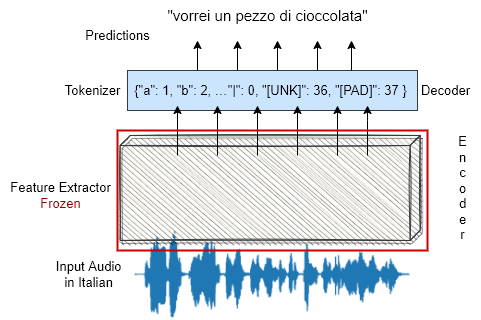

# ASR for Low-resource languages

## Overview
This project aims to perform automatic speech recognition for low-resource languages. To do so we fine-tuned [wav2vec2-xls-r](https://huggingface.co/facebook/wav2vec2-xls-r-300m) [(Babu et al., 2021)](https://arxiv.org/abs/2111.09296) on labeled speech data from different languages from the [Mozilla Common Voice](https://commonvoice.mozilla.org/en/datasets) dataset [(Ardila et al., 2020)](https://github.com/common-voice/cv-dataset).

The scripts in this repo allow to: 
* fine-tune wav2vec2-xls-r on labeled speech data from one language 
* fine-tune wav2vec2-xls-r training jointly two different languages
* test the fine-tuned model 
* test the fine-tuned model incorporating an n-gram language model  

For our purpose we use *characters* as speech units. 
The tokenizers contain the vocabularies for the langauges:
* Italian (it)
* Arabic  (ar)
* Galician (gl)
* Romansh Vallader (rm-vallader) 

To fine-tune wav2vec2-xls-r we use the tokenizer of the language as decoder layer to train the model.

- To *fine-tune* the pre-trained model wav2vec2-xls-r on the target language see the Notebook "Notebook_fine_tuning_wav2vec2_xls_r"
- To create a *bilingual model* by fine-tuning the pre-trained model refer to the the Notebook "Notebook_bilingual_fine_tuning"
- To compute *inferences on the fine-tuned model* use the Notebook "Notebook_inference.ipynb"
- in the second part of the notebook is explained how to compute the inferences using a *Language Model*